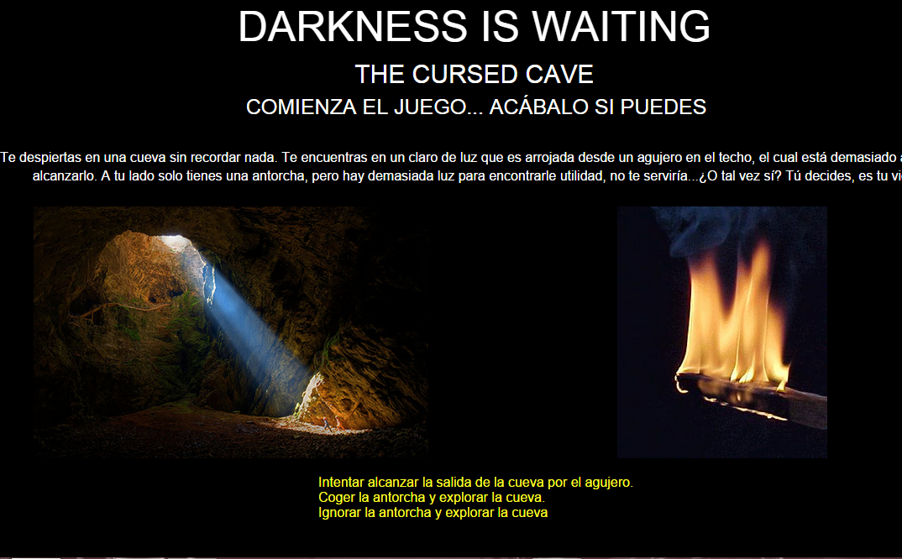

#DIW Pruebas

DIW es un juego español realizado por [Linovsky](https://github.com/Linovsky) y [Gexgekko](https://github.com/Gexgekko).

En este repositorio se hacen pruebas y demás sobre el juego, que puede "jugarse" (mejor dicho probarse) en el siguiente enlace: [DIW](http://gexgekko.github.io/diwpruebas/pruebas/inicio.html#/)

